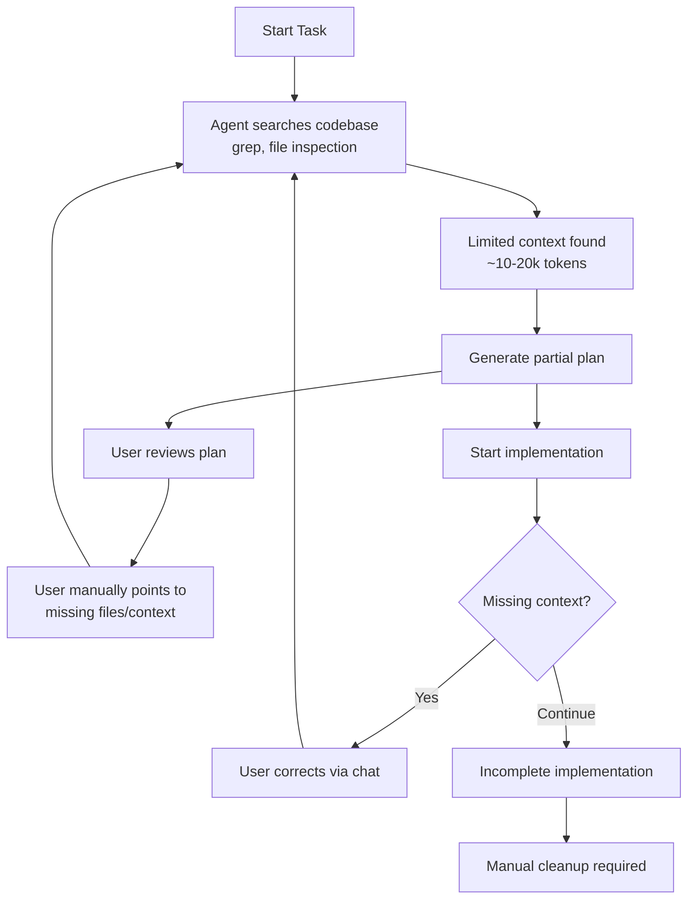
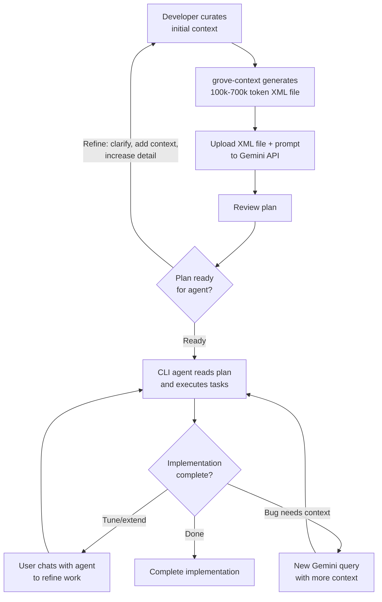

`grove-context` (`cx`) is a CLI tool for assembling multi-repository context for LLMs. It shifts context discovery from ad-hoc agent searching to upfront developer curation, enabling 100k-700k token contexts that produce comprehensive implementation plans. It supports a planning → execution workflow: define what files, repos, and content are relevant to a feature, send that context to a large-context LLM via API (e.g., `gemapi request` with Gemini 2M tokens) to generate an implementation plan, then execute that plan with smaller, focused contexts.

The typical approach today is letting agents discover context on their own - either in "plan mode" or directly during implementation, where the agent greps and inspects the codebase from scratch each time. Many editors and CLI-based agents allow referencing context, but this is ad-hoc: context references scattered across chat history, not reproducible across runs, not shareable with team members. Agent-driven discovery is inefficient (wastes tokens searching), incomplete (misses context in other repos), and lacks architectural understanding that developers have.

The diagram below illustrates this iterative discovery problem:

**Traditional Agent-Only Approach:**

*Figure 1: Traditional agent-only approach with manual context discovery*

Grove-context inverts this model by shifting context discovery from ad-hoc searching to upfront curation. The developer curates exactly what context the feature needs upfront. Think of it as defining a funnel: all code and repos are available, but you're specifying the precise scope where the LLM should focus. The key is including slightly more context than an agent would discover on its own - adjacent modules, related components, relevant documentation. This extra context improves plan quality measurably. You send this curated context in a single API request (e.g., `gemapi request "Create authentication module"`) where the LLM receives 100k-700k tokens of context in one shot. The LLM responds with comprehensive plans that include specific code snippets, architectural patterns, and implementation guidance. The approach is faster: plans are generated quickly because the LLM has everything upfront (no iterative discovery), and implementation is faster because the plan is more complete (less back-and-forth to figure out what was missed).

The following diagram shows how Grove-context streamlines this workflow:

**Grove-Context Large Context Approach:**

*Figure 2: Grove-context approach with upfront context curation and feedback loops*

Plans generated from developer-curated context improve agent implementation success rates. Think of it like room lighting: the large-context LLM API call (100k-700k tokens) illuminates the entire room at once, revealing how all the pieces fit together. The agent executing tasks works with a flashlight, focusing on specific areas as needed. Having both—the comprehensive view during planning and focused execution—leads to quality implementations. When an agent receives a plan with the full picture (relevant files, architectural context, dependencies, tasks), it executes with fewer mistakes. Agents working without comprehensive plans miss details, leading to incomplete implementations and post-hoc cleanup. For larger features, the comprehensive plan can be split into multiple jobs, each tackling a focused portion of the work. The cost per planning request is higher (you're routinely sending 100k+ tokens in single API requests like `gemapi request`), but total development cost is lower through better plans and fewer implementation iterations. Once you have the plan, any CLI agent can read and execute it.

A common pattern is multi-turn planning: start with core context to scope foundational aspects, then iteratively refine in subsequent turns. Each turn serves to 1) correct, clarify, or expand the plan based on the LLM's output, 2) add more relevant context, and 3) increase the level of detail until the plan is concrete enough to hand off to an agent. This iterative refinement within a single conversation produces increasingly detailed, actionable plans. The context definitions are persistent (defined in `.grove/rules` files) and can be easily saved, loaded, and reset as needed, making this process reproducible and shareable.

Context is defined in a `.grove/rules` file using gitignore-style patterns. Beyond basic glob patterns, special directives add powerful capabilities: `@a:` (alias) references pull in files from other repositories and worktrees that Grove knows about, `@grep:` searches file contents across repos, and `@find:` searches file paths—making it easy to gather relevant code from across many repositories. Each repository can define pre-curated rulesets for specific purposes (like `backend-only`, `frontend-only`, or `docs-only`) that provide general starting points. You typically begin with a preset ruleset, then tweak it for each feature—adding specific files, narrowing scope, or pulling in additional context as needed. For example, a feature in your API server can start with a backend ruleset, then add frontend components (`@a:web-app/src/components/**/*.tsx`), shared type definitions (`@a:shared-lib/types/**`), and relevant documentation (`@a:docs/api-reference/**`). These cross-repository capabilities strengthen the breadth of your planning context, ensuring the LLM sees the full picture across your entire codebase ecosystem.

Consider a typical multi-project workspace structure that Grove can work across:

```
~/projects/
├── api-server/           # Backend API (current working directory)
│   ├── .grove/rules      # Rules file we're editing
│   ├── src/
│   └── grove.yml
├── web-app/              # Frontend application
│   ├── src/components/
│   └── grove.yml
├── shared-lib/           # Shared utilities
│   ├── .cx/              # Pre-curated rulesets directory
│   │   ├── backend-only.rules
│   │   ├── frontend-only.rules
│   │   └── full-stack.rules
│   ├── types/
│   └── grove.yml
└── docs/                 # Documentation
    └── api-reference/
```

From within `api-server/`, your `.grove/rules` file can reference code across all these repositories using workspace aliases. Grove discovers these projects automatically and makes them available through the `@a:` syntax.

**Basic patterns** use gitignore-style syntax for including and excluding files:

```groverules
# Include source files from current repository (api-server)
src/**/*.go                                                               ~124.0k tokens (45 files)
Makefile                                                                  ~1.6k tokens
go.mod                                                                    ~869 tokens

# Exclude test files from context
!**/*_test.go                                                             -21 files, -38.3k tokens
!tests/                                                                   -12 files, -28.1k tokens
```

**Import pre-curated rulesets** from other repositories to avoid repeating common context patterns:

```groverules
# Import the "backend-only" ruleset from shared-lib
@a:shared-lib::backend-only                                               ~45.2k tokens (32 files)
```

**Cross-repository references** pull in specific directories or files from other repos:

```groverules
# Include frontend components to understand API integration
@a:web-app/src/components/**/*.tsx                                        ~67.4k tokens (38 files)

# Pull in shared type definitions
@a:shared-lib/types/**/*.ts                                               ~18.9k tokens (12 files)

# Include API documentation
@a:docs/api-reference/**/*.md                                             ~32.1k tokens (8 files)
```

**Search directives** find files across multiple repositories by path or content:

```groverules
# Find all config files across all projects
@a:projects @find: "config"                                               ~89.3k tokens (52 files)

# Search for authentication-related code across api-server and web-app
@a:api-server @grep: "auth"                                               ~42.7k tokens (18 files)
@a:web-app @grep: "auth"                                                  ~28.4k tokens (9 files)
```

**Interactive selection** lets you choose specific files from a ruleset via TUI or editor:

```groverules
# Open TUI to select files from shared-lib's backend ruleset
@view:@a:shared-lib::backend-only
@a:shared-lib/types/user.ts                                               ~2.3k tokens
@a:shared-lib/utils/validator.ts                                          ~4.1k tokens
```

**External repositories** can be cloned and included from GitHub:

```groverules
# Include external HTTP router library for reference
@a:git:gorilla/mux/**/*.go                                                [not_audited | abc1234]
                                                                          ~28.5k tokens (18 files)
```

The generated context file (`.grove/context`) concatenates all matched files with XML structure:

```xml
<?xml version="1.0" encoding="UTF-8"?>
<context>
  <hot-context files="45" description="Files to be used for reference/background context">
    <file path="src/api/server.go">
package api

func StartServer() {
    // implementation
}
...
    </file>
    <file path="src/api/auth.go">
package api

func Authenticate(token string) error {
    // authentication logic
}
...
    </file>
    <file path="shared-lib/types/user.ts">
export interface User {
    id: string;
    name: string;
}
...
    </file>
  </hot-context>
</context>
```

This structured format enables LLMs to efficiently process large codebases while maintaining clear file boundaries and metadata.

Grove-context acts as the foundational context engine for this workflow across the Grove ecosystem.


<!-- placeholder for animated gif -->

## Key Features

-   **Declarative Universe Definition:** Define the complete "universe" of relevant content with `.grove/rules` using gitignore-style patterns, workspace aliases, and imports. For a feature spanning multiple repos, declare everything relevant: backend code (`src/api/**/*.go`), frontend (`@a:web-app/src/**/*.tsx`), shared libraries (`@a:common/types/**`), and documentation.

-   **Workspace-Aware Aliasing:** Reference files across projects with `@a:project-name/path/**/*.ext` - works for your whole team, across machines, in any worktree. Powered by `grove-core`'s workspace discovery, aliases resolve differently based on context (siblings in same ecosystem prioritized). No hardcoded paths.

-   **Reusable Rule Sets & Context Switching:** Create specialized rule sets in `.cx/` for different workflows (`backend-only.rules`, `frontend-only.rules`, `docs-only.rules`). Switch instantly with `cx set-rules backend-only`. Import rule sets across projects with `@a:standards-repo::backend-patterns` to share context definitions across teams.

-   **Multi-Tab Interactive TUI:** Explore and manage context with `cx view`. **TREE tab** shows hierarchical file browser with token counts at every level. **RULES tab** displays and edits active rules. **STATS tab** shows file type distribution and largest contributors. **LIST tab** provides detailed file listing with exclusion capability. Press `s` to switch rule sets, `e` to edit, `r` to refresh.

-   **Token & Cost Analytics:** See exactly what you're sending before API costs hit. `cx stats` shows token counts by file type, language distribution, and largest files. `cx view` displays per-directory token counts. Optimize your 100k+ token contexts before sending to paid APIs.

-   **Security Boundaries:** File inclusion restricted to discovered Grove workspaces and `~/.grove/` directory. Workspace discovery acts as a security boundary, preventing accidental inclusion of system files. Review with `cx list` before sharing context.

-   **Multi-Repo Composition:** Combine context from local repos (`../api/**`), workspace aliases (`@a:backend/**/*.go`), and external Git repos (`cx repo add`). Build comprehensive context spanning 5+ related repositories - essential for modern microservices architectures.

## How It Works

`grove-context` follows a deterministic pipeline to resolve a final list of files:

1.  **Load Rules:** Reads the active rules file - either `.grove/rules` or a named set from `.cx/` (managed via `cx set-rules`).

2.  **Expand Directives:** Recursively expands import directives:
    - `@default` imports project defaults from `grove.yml`
    - `@a:project::ruleset` imports named rule sets from other projects
    - Enables composable, shareable context definitions

3.  **Resolve Aliases:** Transforms workspace aliases to absolute paths using `grove-core`'s discovery:
    - `@a:api-server/src/**/*.go` → `/absolute/path/to/api-server/src/**/*.go`
    - Context-aware: siblings in same ecosystem/worktree prioritized
    - Works consistently across team members and environments

4.  **Filter by Gitignore:** Walks file trees, automatically excluding files matched by `.gitignore` (unless explicitly tracked by git).

5.  **Apply Patterns:** Processes inclusion/exclusion patterns with "last match wins" logic, just like `.gitignore`. Binary files excluded automatically.

6.  **Generate Context:** Concatenates final file list into `.grove/context` with XML structure, ready for LLM consumption. Includes token counts and metadata.

## Ecosystem Integration

`grove-context` serves as foundational infrastructure that enables the planning → execution workflow across Grove tools.

**Planning Phase (Large Contexts):**
-   **`grove-gemini`**: The `gemapi request` command automatically calls `grove-context` to generate comprehensive context from `.grove/rules`. No manual file management - just define your universe and make API calls. Supports large-context planning with Gemini 2M tokens.
-   **`grove-nvim`**: Real-time editor feedback while crafting rule sets. Shows inline token counts as virtual text, interactive rule preview with `<leader>f?` to see matched files, and smart `gf` navigation across workspace aliases. Edit rules → see token changes instantly.

**Execution Phase (Focused Contexts):**
-   **`grove-flow`**: Orchestrates implementation with per-job contexts. Each job can specify `rules_file: .cx/backend-only.rules` in frontmatter - `grove-context` regenerates focused context before execution. Enables breakdown of large plans into targeted tasks, each with precisely the context they need.

**Foundation:**
-   **`grove-core`**: Provides the workspace discovery engine that powers `grove-context`'s alias resolution. Discovers projects, ecosystems, and worktrees across your filesystem, enabling `@a:project` syntax to work consistently for teams.

## Tradeoffs & Considerations

**Learning curve & onboarding**: The directive syntax (`@a:`, `@grep:`, `@find:`, `@view:`, imports) requires upfront effort to adopt. It requires understanding the Grove workspace structure, rules syntax, and which rulesets to use for different tasks. The TUI and editor integration help. For quick one-off tasks, agent discovery may be faster.

**Maintenance & staleness**: As codebases evolve, `.grove/rules` files need updates when project structure changes significantly. The generated `.grove/context` file is a snapshot and will be overwritten unless saved. Pre-curated rulesets in `.cx/` and rule imports help reduce maintenance burden. 

**Rule debugging**: When context is missing expected files or including wrong ones, troubleshooting can be non-obvious. In the `grove-neovim` plugin, virtual text displays token usage, how different rules interact, and pickers for showing which files are included in each rule.  The TUI helps visualize results, but iterating on complex rule files takes time. 

**Context explosion & token limits**: Easy to over-include with broad directives—`@find:` and `@grep:` can match hundreds of files across repos. Bloated contexts can waste tokens on tangential code, reducing signal-to-noise ratio. No automatic guidance on what to exclude when you hit limits; requires manual triage of what's essential vs "nice to have."

**External repo trust**: Including `@a:git:` repos requires either auditing code manually or trusting unaudited external dependencies in your LLM context. The audit workflow exists but adds friction to rapid iteration. Many repos contain context-polluting test files that need to be excluded. 

**Cost model**: At 100k-700k tokens per planning request, costs are higher upfront compared to smaller agent contexts. The bet is that comprehensive planning reduces total development cost through fewer implementation iterations. This tradeoff favors complex, multi-repo features over simple single-file changes.

**Context vs capability**: This approach assumes developers have better architectural understanding than agents can discover autonomously. As models improve at code understanding, this advantage may narrow. However, reproducibility, shareability, and determinism remain valuable even as agent capabilities advance.

## Installation

Install via the Grove meta-CLI:
```bash
grove install context
```

Verify installation:
```bash
cx version
```

Requires the `grove` meta-CLI. See the [Grove Installation Guide](https://github.com/mattsolo1/grove-meta/blob/main/docs/02-installation.md) if you don't have it installed.
